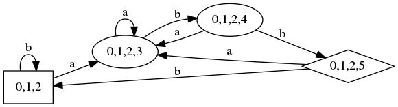
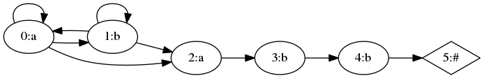

# 正規表現パーサ

連結、和、閉包のみの正規表現をパースして、
決定性有限オートマトン(DFA)及び、
非決定性有限オートマトンに(NFA)に変換し、
それをGraphVizでプロットするプログラムです。

StateTreeが、正規表現をパースして木構造に変換します。
FiniteAutomatonが、その木構造から、オートマトンに変換します。
実装は、ドラゴンブック3章を参考にしています。
§3.9の最適化は実装されていません。

`'(a|b)*abb'` のような入力を、StateTreeが下記のような木構造に変換し、

```
{:type=>:cat,
 :left=>
  {:type=>:cat,
   :left=>
    {:type=>:cat,
     :left=>
      {:type=>:cat,
       :left=>
        {:type=>:star,
         :val=>
          {:type=>:or,
           :left=>{:type=>:char, :pos=>0, :val=>"a"},
           :right=>{:type=>:char, :pos=>1, :val=>"b"}}},
       :right=>{:type=>:char, :pos=>2, :val=>"a"}},
     :right=>{:type=>:char, :pos=>3, :val=>"b"}},
   :right=>{:type=>:char, :pos=>4, :val=>"b"}},
 :right=>{:type=>:char, :pos=>5, :val=>nil}}
```

FiniteAutomatonが下記のような、DFAに変換します。

```
[{:name=>"0,1,2", :trans=>{"a"=>1, "b"=>0}, :type=>:start},
 {:name=>"0,1,2,3", :trans=>{"a"=>1, "b"=>2}, :type=>:mid},
 {:name=>"0,1,2,4", :trans=>{"a"=>1, "b"=>3}, :type=>:mid},
 {:name=>"0,1,2,5", :trans=>{"a"=>1, "b"=>0}, :type=>:end}]
```

`'(a|b)*abb'` をグラフ化したものが、これ。



